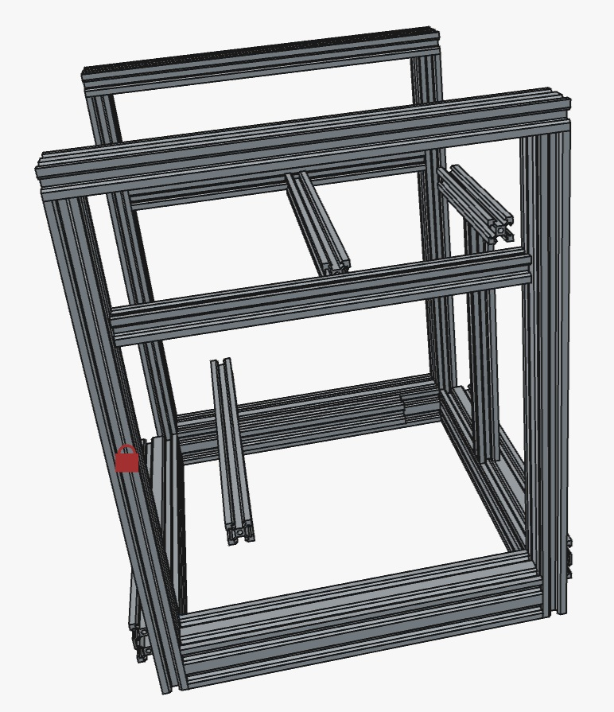

# Trender3

## Introduction

The Trender3 is a printer that can be constructed (mostly) with the parts
from two Ender3s. You will need two additional 2020x290 extrusions for the
Y axis.

The Trender3 is a custom Voron Trident configured for a 170x170x170 build
volume, with 370x370x420 outer dimensions. Everything is inside the outer
dimensions, allowing for a full enclosure to print engineering filaments.

## BOM

The BOM consist of:
- Two older Ender3s disassembled into parts
- 3 x GE5C spherical bearings.
- 20 x F695 flanged bearings.
- 22 x M5 1mm shim/washer (to setup the bearing stack).
- 2 x GT2 20T toothed idler.
- 1 x additional leadscrew and coupler (using 2 from the Ender3s).
- 1 x MGN12H 220mm linear rail (X axis).
- 5 x MGN9H 220mm linear rail (Y and Z axis). Optionally MGN12H works with
  community remixed STLs, and is easier to mount to the extrusions.
- 2 meters Gates GT2 6mm belt.
- 2 x A/B steppers (use the 42-40 which comes from the extruders).
  Note: Pressed on pulleys may mean sourcing different steppers
- 3 x Z steppers (use the 42-34 which comes from the X, Y and Z).
  Note: Pressed on pulleys may mean sourcing different steppers
- A bunch of fasteners and miscelaneous hardware (some reused from the Ender3s).
  Or buy a Trident fastener set from AliExpress.
- Raspberry Pi (or equivalent) with decent performance to run Klipper well.
- A control board with 6 stepper channels (or 5 if you are using a CAN toolhead
  PCB).
- One Ender3 24V PSU
- 5V PSU (or 24V to 5V DC to DC converter, or some control boards providde 5V).
- The Ender3 power switch and connector can be reused for mains power.
- Trident "functional" printed parts (custom size skirts will need to be designed
  for the complete Trident build).
- Optional panels and clips (use cardboard and cloth tape for initial prints).

## Frame

Refer to the following diagram that shows how the extrusions fit together.

The frame should be constructed using the blind joint method. Take care to
ensure that the frame is square before a final tighten of the bolts.

Take the time to get the frame correct before starting to attach parts to it.

## X/Y/Z motion Systems

Follow the Trident assembly manual to install all of the parts. The use of
2040 and 4040 extrusions in the frame should not interfere with the install
of the standard Voron Trident parts.

## Heated Bed Options

The recommended heated bed is for a 160x160 Salad Fork 3d printer, which is
available from AliExpress along with PEI build plates. This also garantees
space off to the side for nozzle brushes, purge containers and other
convenience mods.

I am hoping with the Trident R2 parts fitted, a 180x180 bed could be used. I
believe I heard mention of an extra 10mm of available travel. Again the
180x180 heated bed is for a Salad Fork and is available on AliExpress along
with PEI build plates.

You could also use a Micron 160/1180 beds and drill it to fit. However the
holes need to be countersunk so only do this if you know what you are doing.

While you could get a custom 170x170 bed made, getting a custom sized build
plate would be difficult. So I recommend staying with an available size.

## Electronics Bay Management

I will likely go with an "FT EMS" panel approach to allow flexible placement
of different brands of components. I had a good experience with that on a
Duender, and it is used on Vorons in place of the DIN rails.
