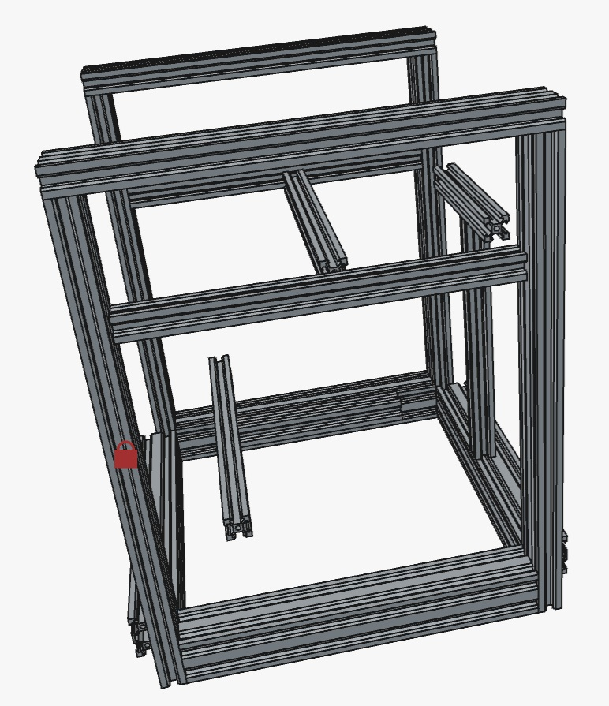
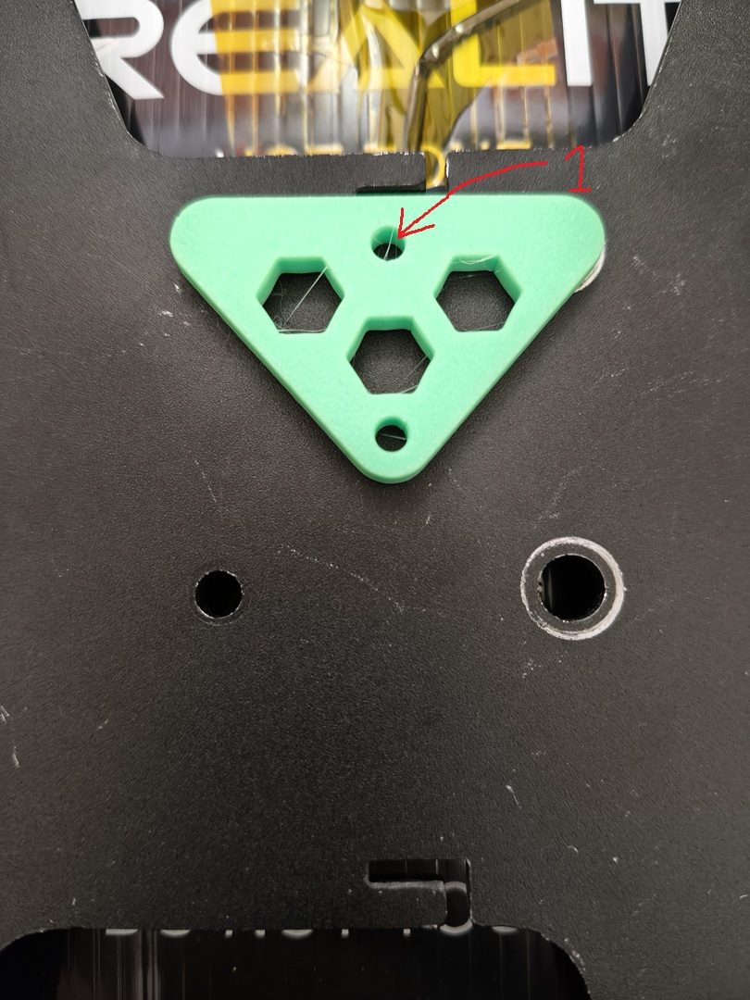
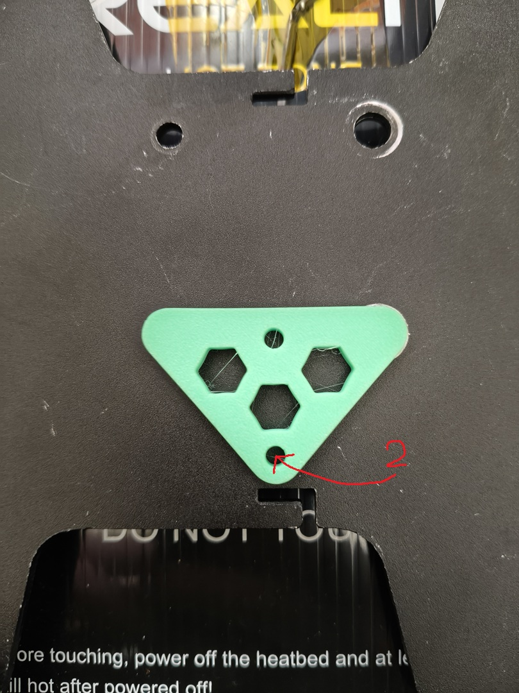
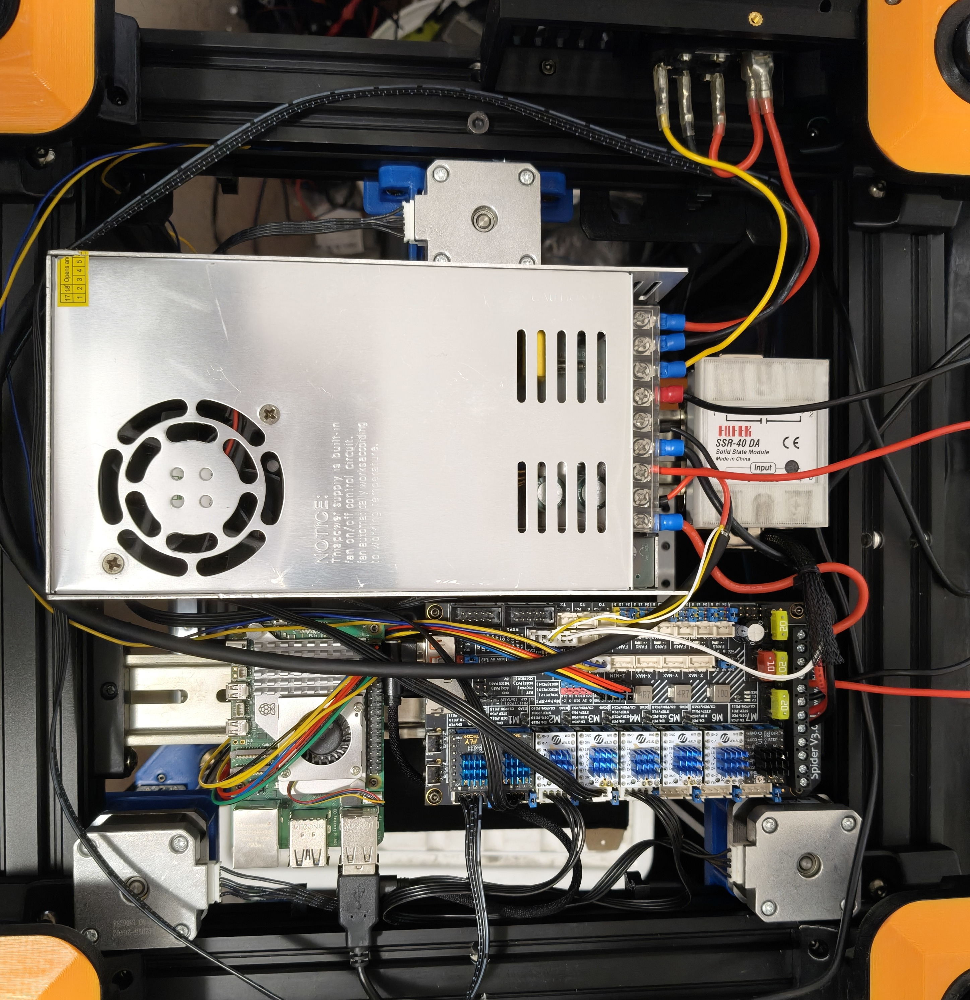

# Trender3

## Introduction

The Trender3 is a printer that can be constructed (mostly) with the parts
from two Ender3s. You will need two additional 2020x290 V-slot extrusions
for the Y axis.

The Trender3 is a custom Voron Trident configured for a 170x170x180 build
volume, with 370x370x420 outer frame dimensions (not including the height
due to feet and skirts). While everything is contained within the outer
frame dimensions, you will need to print a top-hat if you intend to use a
top panel, due to the reduced clearance above the extruder.

Note: A normal 170x170x180 Trident would 410mm between the deck and the top
panels, whereas the Trender3 is 380mm due to the extrusion sizes we have
from the Ender3's. That 30mm loss makes the space above the extruder too
tight for the bowden tube.

## BOM

### Basic BOM
The BOM essentially consists of:
- Two older Ender3s disassembled into parts
- Voron Trident Configurator speced for 170x170x180 (less the parts described below)

### Steppers / Leadscrews
For the A/B steppers you can use the Ender3's extruder steppers (42-40). Make
sure they are the ones with a removable gear and a D shaft. If not you would
need to source some suitable steppers.

For the Z steppers, you can use the X,Y or Z steppers, find 3 that are the same
size (42-34). You don't need a D shaft, or a long shaft, you just need to be able
to remove the pulley/gear from the end. You should have 2 leadscrews and 2 couplers
from the Ender3's, you will need to buy 1 more leadscrew and 1 more Creality style
coupler.

You will need to buy the 3 leadscrew nuts from the Trident BOM, as the Ender3 ones
are not compatible.

Important: Make sure to get leadscrews and nuts with an 8mm lead (4 starts).

### Linear Rails

You will need to buy 3 x MGN12H 220mm and 3 x MGN12H 235mm. The Z axis rails
are 5mm longer than spec so you may not need a spacer/stopper at the top of
the rail (depend on the mix of R1/R2 parts you use). Note: it is recommended
to use a Z2 tolerance rail for X, then Z1 for the others. However Z0 for the
Z axis rails is good as well.

You will need community remixed parts for the MGN12H rails. There are remixes
available for Trident R1 and also for R2, so take your pick.

### PSU and Power Switch

The Ender3 power switch/connector and cord can be reused for mains power. I
have a skirt designed specifically for it.

The 24V 360W PSU from the Ender3 can be used. Both the Meanwell and the other
version fits. If you move to a mains power heated bed you could swap for a lower
power PSU from the Trident BOM. However if you retain the Ender3 heated bed you
will need the power.

## Frame

Refer to the following diagram that shows how the extrusions fit together.

The 4040 and 2040 Ender3 extrusions are used as-is. However the 4 x 2020
extrusions need to be cut. Cut 1 down to 290mm, and 2 down to 250mm. The last
one should be cut into a 152mm length and a 160mm length. You will need 2
additional 290mm lengths of 2020 for the Y axis, which needs to be sourced
separately. Optionally 2 additional 290mm extrusions to brace the top of
the frame, and make panel installation straightforward.

The frame should be constructed using the blind joint method. Take care to
ensure that the frame is square before a final tighten of the bolts.

You should peel of any rubber feet from the Ender3 extrusions, these will not
be needed and they get in the way of aligning the frame.

Take the time to get the frame correct before starting to attach parts to it.

## X/Y/Z motion Systems

Follow the Trident assembly manual to install all of the parts. The use of
2040 and 4040 extrusions in the frame should not interfere with the install
of the standard Voron Trident parts.

## Heated Bed Options

### Ender3 Bed
The most cost effective approach is to re-use an Ender3 bed. You will not be
able to use all of the bed, however it is still functional for 170x170 prints.

The Ender3 bed should just fit between the front leadscews (tested with R1 Z
axis parts). You will need to replace the large wheel nuts with smaller thumb
(knurled) nuts from the Trident BOM (or just M4 nuts in a pinch).

You will need to drill 2x4mm holes in the X shaped plate that the bed attaches to.
A special tool has been provided to provide a precise drilling location. Drill the
first hole with a 4mm drill in the position as shown in the following picture.

Drill the second hole with a 4mm drill in the position as shown in the following
picture.

Use M4 bolts and T-nuts from the Ender3 parts box to mount to the extrusion that
runs front to back. You can adjust the position of the bed to your preference,
just make sure that it doesn't hit anything when the Z axis moves.

### MIC-6 Bed

The recommended heated bed is for a 180x180 Salad Fork 3d printer, which is
available from AliExpress along with a silicon heater and PEI build plate. It
is common to see these beds sold with mounting holes for both the Salad Fork
180 and Micron 180 printers.

In the prefered bed position, the front mounting holes will not be aligned with
the extrusion so a bracket is needed. I haven't yet tackled this so I don't have
a solution. I am wondering if a 3D print would handle the heat, but I would like
to come up with a metal bracket.

## Electronics Bay Management

I have gone with the standard Trident DIN rail configuration. I didn't need a
5V supply for the Raspberry Pi as the Fysetc Spider H7 includes a Pi power
cable. Everything is a tight fit, but it does fit.

There is be an additional 20mm of height in the electronics bay due to the use
of 4040 extrusion. So more space is available if you go up. A mount for the
Raspberry Pi that rotates it 90 degrees would make the fitment less tight.

If I were to do an inverted electronics mod in the future, I would likely go
with an "FT EMS" panel approach to allow flexible placement of different brands
of components. I had a good experience with that on a Duender, and it is used
on Vorons in place of the DIN rails.

## Final thoughts

I have found that Feet and Skirts from "doom cubes" are good inspiration for
what the Trender3 needs. However the small size means that the skirts will not
fit as-is. I have a progressing design for custom skirts and feet for this
project. Some of the skirts are ready now, and I have borrowed some feet that
gets the job done for now.

The toolhead choice is left up to the builder to decide. There are a number
of good choices available for the smaller printers. Just don't make yet
another StealthBurner like I did, so it does work if you insist.

I would recommend an umbilical with a CAN/USB toolhead PCB, to avoid cramming
so many cable chains into something so small. I prefer a swing-arm to support
the umbilical. However there are many Trident solutions to this problem, and
this is a Trident after all, so experiment.
